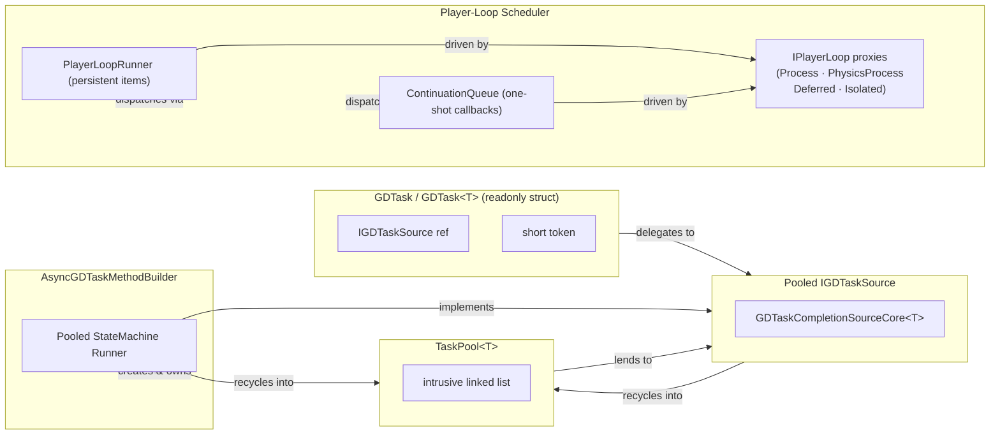
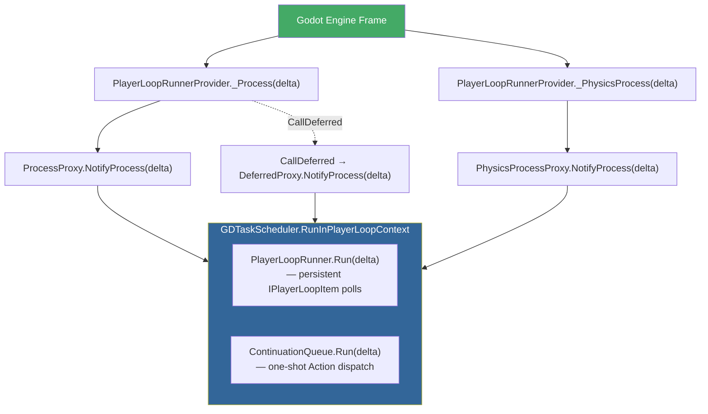
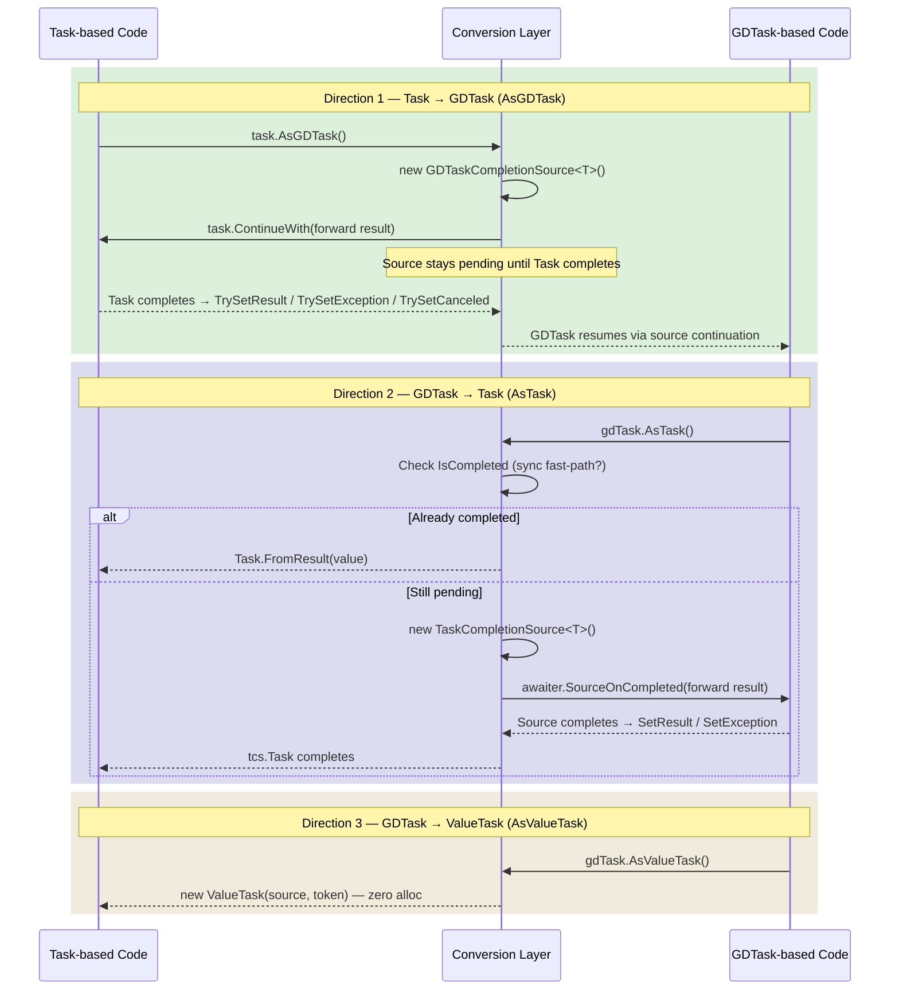
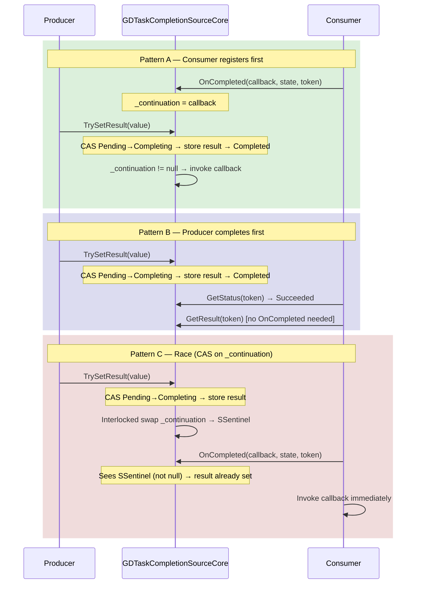

# GDTask Internals — Architecture Deep Dive

> This document walks through the internal design of the **GDTask** library — a Godot-native async/await framework based on [Atlinx's GDTask addon](https://github.com/Fractural/GDTask), itself a port of [Cysharp's UniTask for Unity](https://github.com/Cysharp/UniTask). It explains how GDTask delivers near-zero-allocation `async`/`await` by combining value-type task handles, pooled completion sources, a custom async method builder, and a player-loop–driven scheduler. Each section builds on the previous one, so reading in order is recommended.

---

## 1. Overview

At its core, GDTask replaces the standard .NET `Task` with a lightweight **readonly struct** that carries no heap allocation of its own. The library is built from five cooperating subsystems:

| Component | One-sentence role |
|-----------|-------------------|
| **`GDTask` / `GDTask<T>` structs** | A tiny handle (a reference + a version token) that the compiler uses wherever you write `async GDTask`. When the method returns synchronously, the result is inlined directly in the struct — no object is created at all. |
| **`IGDTaskSource` (pooled source)** | The strategy object behind the handle. It knows how to report status, deliver a result, and accept a **continuation** — a callback the runtime invokes when the operation finishes. Every concrete source is recycled through an object pool after use. |
| **`GDTaskCompletionSourceCore<T>`** | A shared struct engine embedded inside every source. It stores the result or error, manages a version token to enforce the *await-once* rule, and coordinates the race between "producer completes" and "consumer awaits." |
| **`TaskPool<T>` (object pool)** | A lock-free, intrusive linked-list pool. Completed sources push themselves back; new operations pop a recycled instance instead of calling `new`. This is the mechanism that makes repeated async calls virtually allocation-free. |
| **Player-loop scheduler** | A set of Godot scene-tree nodes (`PlayerLoopRunnerProvider`, `IsolatedGDTaskPlayerLoopRunner`) that fire events each frame. Continuations and polling items are dispatched through `ContinuationQueue` and `PlayerLoopRunner` so that `await` resumes on the correct engine timing — `Process`, `PhysicsProcess`, `Deferred`, or an isolated variant. |

The **awaiter** is a small nested struct inside `GDTask` that implements the compiler's *awaiter pattern* (`IsCompleted`, `GetResult`, `OnCompleted`). It is the bridge the C# compiler uses to wire `await` expressions to the source. The **custom async method builder** (`AsyncGDTaskMethodBuilder`) intercepts the compiler-generated state machine, stores it in a pooled runner object instead of a heap-allocated `Task`, and connects it to an `IGDTaskSource` so the caller receives a zero-alloc `GDTask` handle.

### Key definitions

Before we continue, here are short definitions for terms used throughout this document:

- **readonly struct** — a C# value type whose fields cannot be modified after construction. Because it lives on the stack (or inline in another struct), it does not require a heap allocation or garbage collection.
- **pooled source** — an object that is not discarded after use but returned to a reuse pool, avoiding repeated `new` allocations.
- **awaiter** — a helper object the C# compiler looks for when you write `await`. It tells the compiler how to check completion, retrieve the result, and register a callback for later resumption.
- **continuation** — the "rest of the method" after an `await`. The runtime packages it as a delegate and hands it to the awaiter so it can be invoked when the awaited operation finishes.
- **player loop** — Godot's per-frame callback cycle (`_Process`, `_PhysicsProcess`, etc.). GDTask hooks into this loop to drive delays, polling, and continuation dispatch without timers or threads.

### Diagram D1 — Component Relationship Map



### Typical lifecycle of an `await`

Here is the common path a GDTask follows from creation to completion:

1. **Create handle** — An async method (or factory like `GDTask.Delay`) produces a `GDTask` struct containing a reference to a pooled `IGDTaskSource` and a version token.
2. **`await` — compiler calls `GetAwaiter()`** → returns the nested `Awaiter` struct.
3. **Check `IsCompleted`** — The awaiter asks the source for its status.
   - **Synchronous path (fast):** The operation already finished. `GetResult()` extracts the value directly — no suspension, no continuation, no allocation.
   - **Asynchronous path:** The operation is still pending. The compiler calls `OnCompleted`, which registers a continuation (the rest of the method) on the source.
4. **Suspend** — The current method yields control. The state machine is stored in a pooled runner.
5. **Resume** — When the source completes (e.g., a timer expires, a signal fires), it invokes the stored continuation. The scheduler ensures the callback runs on the correct player-loop timing.
6. **`GetResult()` → return to pool** — The consumer retrieves the result (or exception). The source resets its internal state, increments its version token, and pushes itself back into the pool for reuse.

---

## 2. The GDTask / GDTask<T> Value Types

A `GDTask` is the public face of the library — the type you write after `async` and the type you `await`. Understanding its struct layout explains why synchronous completions are free and why each task can only be awaited once.

### 2.1 Struct Layout and Inline Result Fast-Path

`GDTask` is declared as a **`readonly struct`** with `[StructLayout(LayoutKind.Auto)]`, which lets the compiler reorder fields for optimal packing. It contains exactly two fields:

```
┌──────────────────────────────────┐
│  GDTask  (readonly struct)       │
│  ┌────────────────────────────┐  │
│  │ IGDTaskSource source (ref) │  │  ← null when completed synchronously
│  │ short token                │  │  ← version for await-once enforcement
│  └────────────────────────────┘  │
└──────────────────────────────────┘
```

- When `source` is **`null`**, the task is already successfully completed. The `Status` property short-circuits to `Succeeded`, and `GetResult()` returns immediately. No heap object was ever created — the entire round-trip lives on the stack.
- When `source` is **non-null**, it points to a pooled `IGDTaskSource` instance that manages the pending operation. The `token` field must match the source's current version; a mismatch means the source was already recycled and this handle is stale.

`GDTask<T>` extends this idea with a third field:

```
┌──────────────────────────────────────┐
│  GDTask<T>  (readonly struct)        │
│  ┌────────────────────────────────┐  │
│  │ IGDTaskSource<T> source (ref)  │  │
│  │ T result                       │  │  ← inline result for sync completion
│  │ short token                    │  │
│  └────────────────────────────────┘  │
└──────────────────────────────────────┘
```

The constructor `GDTask<T>(T result)` sets `source = null` and stores the value directly in `result`. When you `await` such a task, the awaiter sees `IsCompleted == true`, reads the inlined value, and never touches the heap. This is the **inline result fast-path** — the key reason lightweight operations like `GDTask.FromResult(42)` cost nothing.

### 2.2 Awaiter Pattern and Custom Builder Binding

The C# compiler requires two things to make a type awaitable and usable as an `async` return type:

1. **Awaiter pattern** — The type must expose `GetAwaiter()` returning an object with `IsCompleted`, `GetResult()`, and `OnCompleted(Action)` / `UnsafeOnCompleted(Action)`.
2. **`[AsyncMethodBuilder]` attribute** — This tells the compiler which builder type to use for `async` methods that return this type.

`GDTask` satisfies both:

- **`GetAwaiter()`** returns `GDTask.Awaiter`, a nested readonly struct. Its `IsCompleted` property delegates to `source.GetStatus(token).IsCompleted()`. Its `GetResult()` calls `source.GetResult(token)`. Its `UnsafeOnCompleted(Action)` wraps the continuation and calls `source.OnCompleted(...)`. Because the awaiter is a struct, it adds no allocation.
- **`[AsyncMethodBuilder(typeof(AsyncGDTaskMethodBuilder))]`** on `GDTask` (and `AsyncGDTaskMethodBuilder<>` on `GDTask<T>`) tells the compiler to route all `async GDTask` methods through a custom builder that avoids the standard `Task` allocation machinery. The builder is covered in detail in a later section.

The awaiter also exposes `SourceOnCompleted(Action<object>, object)` for internal callers that want to register a continuation with an explicit state object, avoiding the closure allocation that a bare `Action` would require.

> **`Preserve()` and multi-await.** By default a `GDTask` can only be awaited once (the source is recycled after `GetResult`). If you need to await the same logical result from multiple places, call `.Preserve()`. This wraps the source in a `MemoizeSource` that caches the outcome and allows repeated reads. `MemoizeSource` itself is *not* pooled — the trade-off is one small allocation in exchange for safe multi-await.

---

## 3. IGDTaskSource Contracts

Every `GDTask` struct is either complete (source is null) or backed by an `IGDTaskSource`. This interface is the **strategy pattern** at the heart of the library: delays, signals, completion sources, and state-machine runners all implement it, yet the `GDTask` handle neither knows nor cares which concrete type is behind the reference.

### 3.1 IGDTaskSource / IGDTaskSource<T> — The Strategy Interface

The contract is deliberately minimal:

| Method | Purpose |
|--------|---------|
| `GDTaskStatus GetStatus(short token)` | Returns the current status: `Pending`, `Succeeded`, `Faulted`, or `Canceled`. The `token` must match the source's version. |
| `void GetResult(short token)` | Retrieves the result (or throws the stored exception). For `IGDTaskSource<T>`, the return type is `T` instead of `void`. Calling this typically triggers the source to recycle itself — so it must only be called once. |
| `void OnCompleted(Action<object> continuation, object state, short token)` | Registers a single continuation to be invoked when the source transitions out of `Pending`. Only one continuation may be registered per lifetime — a second registration throws. |
| `GDTaskStatus UnsafeGetStatus()` | Same as `GetStatus` but skips the token check. Used by diagnostic tools only. |

`IGDTaskSource` also implements `IValueTaskSource` with explicit interface methods, so any `GDTask` can be converted to a standard `ValueTask` via `AsValueTask()`.

Note that `OnCompleted` accepts `Action<object>` plus a separate `object state` rather than a bare `Action`. This avoids allocating a closure — the state is passed as a separate argument and cast back inside the callback.

### 3.2 ValueTask-Style Consumption Rules (Await-Once, Version Tokens)

GDTask borrows the same consumption discipline as .NET's `IValueTaskSource`:

- **Await-once:** Each (source, token) pair may only be consumed once — one `GetResult` call, one `OnCompleted` registration. After consumption the source resets, bumps its version, and returns to the pool. Any subsequent access with the old token throws `InvalidOperationException`.
- **Version tokens:** The `short token` acts as a generation counter. When a pooled source is recycled, its version increments. If a stale `GDTask` handle tries to use the source with an outdated token, the mismatch is caught immediately. This is the same mechanism that `ValueTask` uses to detect misuse of pooled `IValueTaskSource` instances.

These constraints exist because pooling and safety are at odds: once a source is returned to the pool, another operation may claim it. The version token is the lightweight guard that keeps this safe without requiring a full ownership-tracking system.

> **Why not just use `ValueTask`?** `ValueTask` carries similar constraints but routes continuations through `ExecutionContext` and `SynchronizationContext` by default. GDTask intentionally skips both (see §4.3), and it adds Godot-specific scheduling (player-loop dispatch) that `ValueTask` has no concept of.

---

## 4. GDTaskCompletionSourceCore<T>

Most `IGDTaskSource` implementations do not manage completion logic themselves. Instead they embed a **`GDTaskCompletionSourceCore<TResult>`** — a reusable struct that handles result storage, status transitions, version tokens, and continuation dispatch. Think of it as the engine block shared by every concrete source, a pattern borrowed from .NET's `ManualResetValueTaskSourceCore<T>`.

### 4.1 Struct Layout, Completion States, and Version Tokens

The core is a mutable struct (not `readonly` — it needs to update its fields) with the following layout:

| Field | Type | Purpose |
|-------|------|---------|
| `_result` | `TResult` | The successful result value. |
| `_error` | `object` | Either an `ExceptionHolder` (wraps `ExceptionDispatchInfo`) or a bare `OperationCanceledException`. Null on success. |
| `_hasUnhandledError` | `bool` | Set to `true` when an error is stored but not yet observed by `GetResult`. On `Reset()`, any unhandled error is published to `GDTaskExceptionHandler`. |
| `_completedCount` | `int` | A three-state field: `Pending (0)` → `Completing (1)` → `Completed (2)`. Transitions are guarded by `Interlocked.CompareExchange`. |
| `_continuation` | `Action<object>` | The single registered callback. Set by `OnCompleted` or swapped to a sentinel by `TrySetResult`/`TrySetException`. |
| `_continuationState` | `object` | The state argument passed alongside the continuation. |
| `Version` | `short` | Incremented on every `Reset()`. Callers must present the matching token for every operation. |

The three-phase completion state (`Pending` → `Completing` → `Completed`) is the key to thread-safety. A producer thread uses `Interlocked.CompareExchange` to move from `Pending` to `Completing`; if two producers race, only one wins the CAS and the other gets `false` back. After storing the result (or error), the winner publishes `Completed` via `Volatile.Write`, ensuring all subsequent readers see the new value.

### 4.2 Continuation Registration and Race-Condition Handling

The hardest part of any completion-source is coordinating the **producer** (who calls `TrySetResult`) with the **consumer** (who calls `OnCompleted`). Three patterns can occur:

| Pattern | Sequence | How it is handled |
|---------|----------|-------------------|
| **A — Consumer first** | `GetStatus` → `Pending` → `OnCompleted` stores continuation → `TrySetResult` sees stored continuation → invokes it. | Normal path. The continuation field is non-null when the producer checks, so it calls the delegate directly. |
| **B — Producer first** | `TrySetResult` completes → `GetStatus` → `Succeeded` → `GetResult` | The consumer never calls `OnCompleted` at all; it reads the result synchronously. |
| **C — Race** | `GetStatus` → `Pending` → both `TrySetResult` and `OnCompleted` execute concurrently. | The CAS on `_continuation` decides the winner. If `OnCompleted` wins, it stores the real callback and the producer finds it later. If `TrySetResult` wins, it swaps in a **sentinel** delegate (`SSentinel`). When `OnCompleted` then sees the sentinel instead of null, it knows the result is already available and invokes the continuation immediately from the consumer's thread. |

The sentinel (`GDTaskCompletionSourceCoreShared.SSentinel`) is a static dummy delegate whose only job is to signal "the producer already finished." It is never actually invoked — if something accidentally calls it, it throws `InvalidOperationException` to surface the bug.

### 4.3 No ExecutionContext / SynchronizationContext Capture — By Design

The standard .NET `ManualResetValueTaskSourceCore<T>` accepts `ValueTaskSourceOnCompletedFlags` to optionally capture and flow `ExecutionContext` and `SynchronizationContext`. GDTask's core **ignores these flags entirely** — the source comment reads:

> *"no use ValueTaskSourceOnCompletedFlags, always no capture ExecutionContext and SynchronizationContext."*

This is a deliberate performance decision:

- **[ExecutionContext](https://learn.microsoft.com/en-us/dotnet/api/system.threading.executioncontext)** normally carries security and logical-call-context data across `await` boundaries. Capturing and restoring it on every continuation adds measurable overhead. Game code running inside a single Godot process rarely needs this facility.
- **[SynchronizationContext](https://learn.microsoft.com/en-us/dotnet/api/system.threading.synchronizationcontext)** is the .NET mechanism for posting work back to a specific thread (e.g., the UI thread in WPF). GDTask replaces this entirely with its own player-loop scheduler: continuations are enqueued into a `ContinuationQueue` driven by the Godot scene tree, not posted through `SynchronizationContext.Post`.

The trade-off is that `async GDTask` methods do **not** automatically return to the thread or context they started on (unless the scheduler happens to dispatch there). For game code this is usually the desired behavior — you want to resume on the next `_Process` or `_PhysicsProcess`, not on "whatever context captured the await." If you do need to switch threads explicitly, GDTask provides `SwitchToMainThread()` and `SwitchToThreadPool()`.

---

## 5. Object Pooling — TaskPool<T>

The previous sections showed that `IGDTaskSource` instances are recycled rather than discarded. The recycling infrastructure is `TaskPool<T>`, a minimal, lock-free, stack-like pool that every concrete source type uses.

### 5.1 ITaskPoolNode<T> Intrusive Linked List

Rather than maintaining a separate `List<T>` or `ConcurrentBag<T>`, GDTask uses an **intrusive linked list**. Each poolable type implements `ITaskPoolNode<T>`:

```csharp
interface ITaskPoolNode<T>
{
    ref T NextNode { get; }
}
```

The implementing class stores a `T _nextNode` field and exposes it via `ref` return. The pool threads the objects themselves into a singly-linked chain — no wrapper nodes, no arrays, no extra allocations. The `ref` return lets the pool manipulate the field directly without going through a property setter, shaving off the tiny overhead of an extra method call.

> **Why "intrusive"?** In a normal linked list, each element is wrapped inside a separate `Node` object. In an *intrusive* list, the link pointer lives inside the element itself. This avoids one allocation per entry and improves cache locality because the data and the link occupy the same memory block.

### 5.2 Lock-Free Push / Pop via Interlocked

`TaskPool<T>` is a mutable struct with three fields:

| Field | Type | Purpose |
|-------|------|---------|
| `gate` | `int` | A CAS-based spinlock (0 = free, 1 = locked). |
| `root` | `T` | Head of the intrusive linked list. |
| `Size` | `int` | Current number of pooled items. |

**`TryPop`** attempts to acquire the gate with `Interlocked.CompareExchange(ref gate, 1, 0)`. If the CAS succeeds (gate was `0`), it reads `root`, advances the head to `root.NextNode`, decrements `Size`, releases the gate with `Volatile.Write(ref gate, 0)`, and returns the popped item. If the CAS fails (another thread holds the gate), the method immediately returns `false` — it does **not** spin or block. The caller falls back to `new T()`.

**`TryPush`** follows the same pattern: acquire gate → check `Size < TaskPool.MaxPoolSize` → prepend item to the list → release gate. If the pool is at capacity or the gate is held, the push fails and the item becomes eligible for garbage collection.

This "try-once" design means the pool is never a contention bottleneck. Under high concurrency, some allocations may slip through, but the common single-threaded game-loop path always succeeds on the first try.

### 5.3 MaxPoolSize Cap and Runtime Mutation

The static property `TaskPool.MaxPoolSize` (default: `int.MaxValue`, effectively unbounded) places an upper limit on the number of items **each** pool instance may retain. This cap is evaluated on every `TryPush`:

```
if (Size < TaskPool.MaxPoolSize) { /* accept */ }
else { /* reject — item will be GC'd */ }
```

You can lower `MaxPoolSize` at runtime (for example, to conserve memory in a resource-constrained scene). The change affects only future pushes — objects already stored in the pool are never trimmed or evicted. They continue to be popped and reused normally until the pool naturally drains below the new limit.

Because each concrete source type (e.g., `DelayPromise`, `YieldPromise`, `AutoResetGDTaskCompletionSource`, and each closed generic such as `AsyncGDTask<TStateMachine>`) maintains its **own** `static TaskPool<T>` field, the cap applies per type, not as a global sum across all pools.

`AutoResetGDTaskCompletionSource` / `AutoResetGDTaskCompletionSource<T>` are also part of the public API (since 3.2.0) for user code that needs pooled, reusable completion sources. The public surface is limited to `Create()`, `Task`, and `TrySet*`. Awaiter members, `CreateFrom*` factories, and pool linkage (`ITaskPoolNode<T>.NextNode`) are not exposed on the public type surface.

---

## 6. Custom Async Method Builders

When you write `async GDTask`, the C# compiler does not use the standard `AsyncTaskMethodBuilder`. Instead, the `[AsyncMethodBuilder]` attribute on `GDTask` directs the compiler to `AsyncGDTaskMethodBuilder` — a custom **mutable struct** that intercepts every step of the compiler-generated state machine and routes it through GDTask's pooled infrastructure.

### 6.1 AsyncGDTaskMethodBuilder / AsyncGDTaskMethodBuilder\<T\>

The builder has a simple lifecycle that the compiler drives automatically:

1. **`Create()`** — Returns `default`. The struct starts with `_runnerPromise == null` and `_exception == null`.
2. **`Start(ref TStateMachine)`** — Immediately calls `stateMachine.MoveNext()`. This executes the method body up to the first `await` (or to the end if the method completes synchronously).
3. **First suspension → `AwaitUnsafeOnCompleted(ref awaiter, ref stateMachine)`** — This is where the allocation decision is made:
   - If `_runnerPromise` is still `null`, the builder calls `AsyncGDTask<TStateMachine>.SetStateMachine(ref stateMachine, ref _runnerPromise)`, which **pops a pooled runner** (or allocates one if the pool is empty) and **copies the struct state machine** into it. From this point on, the runner owns the state machine.
   - The builder then calls `awaiter.UnsafeOnCompleted(_runnerPromise.MoveNext)`, registering the runner's pre-allocated `Action` delegate as the continuation on the awaiter.
4. **`SetResult()` / `SetException(Exception)`** — When the method finishes, the compiler calls one of these. The builder routes the call to the runner if one was created; otherwise it stores the result or exception locally (for the synchronous path).
5. **`Task` property** — The compiler reads this after `Start()` returns, to obtain the `GDTask` handle that the caller will `await`. Three cases:
   - `_runnerPromise != null` → return `_runnerPromise.Task` (a `GDTask` backed by the runner-as-`IGDTaskSource`).
   - `_exception != null` → return `GDTask.FromException(_exception)`.
   - Otherwise → return `GDTask.CompletedTask` (a `GDTask` with `source == null`).

**Synchronous fast-path:** If the entire method body runs to completion before any `await` actually suspends (i.e., every awaited operation was already complete), the builder never allocates a runner at all. `_runnerPromise` stays `null`, and the `Task` getter returns a zero-allocation `GDTask.CompletedTask` (or `GDTask.FromResult(result)` for the generic variant). This is the key insight — the vast majority of game-loop async methods that poll frame-by-frame complete synchronously most of the time, and GDTask pays nothing for those completions.

`AsyncGDTaskMethodBuilder<T>` follows the same pattern with two additions: it stores a `T result` field for the synchronous path, and it uses `IStateMachineRunnerPromise<T>` / `AsyncGDTask<TStateMachine, T>` as the runner type.

Both builders have an empty `SetStateMachine(IAsyncStateMachine)` body — this prevents the runtime from boxing the struct state machine into the heap via the standard `IAsyncStateMachine` interface, which would defeat the purpose of the pooled runner.

#### Diagram D2 — Builder Interaction with State-Machine Runner

```mermaid
sequenceDiagram
    participant Compiler
    participant Builder as AsyncGDTaskMethodBuilder
    participant Runner as AsyncGDTask&lt;TSM&gt; (pooled)
    participant Awaiter as Inner Awaiter

    Compiler->>Builder: Create()
    Note over Builder: _runnerPromise = null
    Compiler->>Builder: Start(ref stateMachine)
    Builder->>Builder: stateMachine.MoveNext()
    Note over Builder: Executes until first real suspension

    alt Synchronous completion (no suspension)
        Compiler->>Builder: SetResult()
        Note over Builder: _runnerPromise still null
        Compiler->>Builder: .Task
        Builder-->>Compiler: GDTask.CompletedTask (zero alloc)
    else First suspension
        Compiler->>Builder: AwaitUnsafeOnCompleted(awaiter, stateMachine)
        Builder->>Runner: SetStateMachine(ref stateMachine) [pool checkout + copy]
        Builder->>Awaiter: UnsafeOnCompleted(runner.MoveNext)
        Compiler->>Builder: .Task
        Builder-->>Compiler: GDTask(runner, core.Version)
        Note over Awaiter: ...awaited operation completes...
        Awaiter->>Runner: MoveNext() [invoke Action delegate]
        Runner->>Runner: stateMachine.MoveNext()
        Note over Runner: Method resumes, reaches SetResult
        Runner->>Runner: core.TrySetResult(...)
        Note over Runner: Continuation fires → caller resumes
        Note over Runner: GetResult() → TryReturn() → pool
    end
```

### 6.2 AsyncGDTaskVoidMethodBuilder — Fire-and-Forget GDTaskVoid

`GDTaskVoid` is the fire-and-forget counterpart of `GDTask`. Its builder, `AsyncGDTaskVoidMethodBuilder`, differs from the regular builder in two important ways:

1. **No `Task` return value.** The `Task` property returns `default(GDTaskVoid)` — a zero-size struct. There is no handle for the caller to await. The builder uses `IStateMachineRunner` (not `IStateMachineRunnerPromise`) and `AsyncGDTaskVoid<TStateMachine>` as its runner.

2. **Unobserved exception routing.** When `SetException(Exception)` is called:
   - The runner (if any) is returned to the pool first via `_runner.Return()`.
   - The exception is published to `GDTaskExceptionHandler.PublishUnobservedTaskException(exception)`.
   This is a critical safety improvement over `async void`, which throws unobserved exceptions directly onto the `SynchronizationContext` (often crashing the process). `GDTaskVoid` routes them through a configurable handler where game code can log, report, or suppress them.

`SetResult()` simply returns the runner to the pool — there is no value to deliver and no continuation to fire.

---

## 7. Pooled State-Machine Runners

The runners are the heap-resident objects that hold the compiler-generated state machine while an `async GDTask` method is suspended. They are the **single allocation** that GDTask makes for an asynchronous method — and because they are pooled, that allocation happens only once per closed generic type across the lifetime of the process.

### 7.1 IStateMachineRunner / IStateMachineRunnerPromise Interfaces

Two internal interfaces define the runner contract:

| Interface | Inherits | Purpose |
|-----------|----------|---------|
| `IStateMachineRunner` | — | Minimal contract for fire-and-forget runners. Exposes `Action MoveNext` (the pre-allocated delegate) and `void Return()` (sends the runner back to the pool). |
| `IStateMachineRunnerPromise` | `IGDTaskSource` | Extends the runner with completion semantics: `GDTask Task` (the handle that the builder returns to the caller), `SetResult()`, and `SetException(Exception)`. Because it implements `IGDTaskSource`, the runner **is** the source that the `GDTask` handle points to. |
| `IStateMachineRunnerPromise<T>` | `IGDTaskSource<T>` | Generic variant — `GDTask<T> Task`, `SetResult(T)`. |

The key insight is that the runner and the source are the **same object**. There is no separate source allocation — the pooled runner doubles as the `IGDTaskSource` that the `GDTask` struct references.

### 7.2 AsyncGDTask\<TStateMachine\> — Pooled Runner for GDTask

`AsyncGDTask<TStateMachine>` is a `sealed class` that implements `IStateMachineRunnerPromise` and `ITaskPoolNode<AsyncGDTask<TStateMachine>>`. Its key fields:

| Field | Type | Purpose |
|-------|------|---------|
| `_stateMachine` | `TStateMachine` | The compiler-generated struct state machine, copied in by value. |
| `_core` | `GDTaskCompletionSourceCore<AsyncUnit>` | The shared completion engine (result/error storage, version token, continuation). |
| `_nextNode` | `AsyncGDTask<TStateMachine>` | Intrusive linked-list pointer for `TaskPool`. |
| `MoveNext` | `Action` (property) | Initialized once in the private constructor as `MoveNext = Run;`, where `Run()` calls `_stateMachine.MoveNext()`. This delegate is allocated **once per pooled instance** and reused across all checkouts. |

The static `Pool` field is a `TaskPool<AsyncGDTask<TStateMachine>>` — one pool per closed generic (i.e., per distinct async method signature). The `Task` property returns `new GDTask(this, _core.Version)`, making the runner itself the backing source.

When `GetResult(short token)` is called (by the outer awaiter when the caller finishes consuming the result), it calls `_core.GetResult(token)` and then `TryReturn()` in a `finally` block, which resets the core, clears the state machine, and pushes the runner back into the pool.

### 7.3 AsyncGDTask\<TStateMachine, T\> — Pooled Runner for GDTask\<T\>

Structurally identical to the non-generic variant, but with `GDTaskCompletionSourceCore<T> _core` so it can store a typed result. Implements `IStateMachineRunnerPromise<T>` and returns `new GDTask<T>(this, _core.Version)` from its `Task` property. The `GetResult` method returns the `T` value and recycles the runner via `TryReturn()`.

### 7.4 AsyncGDTaskVoid\<TStateMachine\> — Pooled Runner for GDTaskVoid

This runner differs from the others because `GDTaskVoid` has no awaitable handle:

- Implements `IStateMachineRunner` (not `IStateMachineRunnerPromise`) and `ITaskPoolNode`.
- Also implements `IGDTaskSource` with **dummy** no-op methods — `GetStatus` always returns `Pending`, `OnCompleted` does nothing. This exists solely to satisfy the `TaskTracker` diagnostic system, which tracks all active sources.
- `Return()` removes tracking, clears the state machine, and pushes the runner back to its own `TaskPool<AsyncGDTaskVoid<TStateMachine>>`.
- `SetStateMachine(ref stateMachine, ref IStateMachineRunner)` follows the same pop-or-new → track → copy pattern as the other runners.

### 7.5 Lifecycle: Checkout → Copy State Machine → MoveNext → Return to Pool

#### Diagram D5 — Pooling Lifecycle

```mermaid
flowchart LR
    Pool["TaskPool&lt;AsyncGDTask&lt;TSM&gt;&gt;"]
    Pop{"TryPop?"}
    New["new AsyncGDTask&lt;TSM&gt;()"]
    Runner["Runner instance"]
    Copy["Copy struct state machine"]
    Track["TaskTracker.TrackActiveTask"]
    Use["stateMachine.MoveNext()\n(may be called multiple times)"]
    Result["SetResult / SetException"]
    GetResult["GetResult(token) called by consumer"]
    Reset["core.Reset() +\n_stateMachine = default"]
    Push{"TryPush?"}
    GC["Eligible for GC\n(pool at capacity)"]

    Pool --> Pop
    Pop -- "hit" --> Runner
    Pop -- "miss" --> New --> Runner
    Runner --> Track --> Copy --> Use
    Use --> Result --> GetResult
    GetResult --> Reset --> Push
    Push -- "accepted" --> Pool
    Push -- "cap exceeded" --> GC
```



The pre-allocated `MoveNext` delegate (`MoveNext = Run;` set in the constructor) is the reason the runner can be checked out and returned without ever allocating a new `Action`. The delegate captures `this` once at construction time and remains valid across all future uses of the same pooled instance.

---

## 8. Player-Loop Dispatch Infrastructure

GDTask does not use `SynchronizationContext`, `TaskScheduler`, or thread-pool work items for continuation dispatch. Instead, it hooks into Godot's scene-tree frame loop through a set of proxy objects, routing work to the exact frame phase the caller requested: `_Process`, `_PhysicsProcess`, deferred, or an isolated variant that runs even when the scene tree is paused.

### 8.1 IPlayerLoop / PlayerLoopTiming / IPlayerLoopItem Abstractions

Three types form the scheduling vocabulary:

| Type | Kind | Role |
|------|------|------|
| `IPlayerLoop` | `interface` | An event source with `event Action<double> OnProcess` and `event Action OnPredelete`. Any object that fires these events can drive GDTask scheduling — the five built-in proxies do so from Godot callbacks, but user code can implement custom loops. |
| `PlayerLoopTiming` | `enum` | Names the five built-in loop phases: `Process` (0), `PhysicsProcess` (1), `IsolatedProcess` (2), `IsolatedPhysicsProcess` (3), `DeferredProcess` (4). Methods like `GDTask.Yield(PlayerLoopTiming)` accept this enum and resolve it to the corresponding `IPlayerLoop` via `GDTaskScheduler.GetPlayerLoop`. |
| `IPlayerLoopItem` | `interface` | A polling item with a single method `bool MoveNext(double deltaTime)`. Returning `true` means "keep calling me next frame"; returning `false` means "I'm done, remove me." Every delay/wait promise implements this interface. |

### 8.2 GDTaskScheduler — Central Dispatcher

`GDTaskScheduler` is an internal static class that connects `IPlayerLoop` event sources to the two dispatch mechanisms:

| Member | Purpose |
|--------|---------|
| `ConcurrentDictionary<IPlayerLoop, PlayerLoopRunner> Runners` | Maps each loop to a `PlayerLoopRunner` that manages persistent `IPlayerLoopItem` instances (delays, wait-until polls). |
| `ConcurrentDictionary<IPlayerLoop, ContinuationQueue> Yielders` | Maps each loop to a `ContinuationQueue` that manages one-shot `Action` continuations (yield, next-frame). |
| `[ThreadStatic] IPlayerLoop _currentPlayerLoop` | Tracks which loop is currently executing, set/restored by `RunInPlayerLoopContext`. Used by `IsCurrentPlayerLoop` to detect same-loop re-entry. |
| `int MainThreadId` | Lazily resolved on first access via `Dispatcher.SynchronizationContext.Send`. Used by `IsMainThread` to gate engine API calls. |

**`AddAction(IPlayerLoop, IPlayerLoopItem)`** uses `GetOrAdd` with a factory that lazily creates a `PlayerLoopRunner`, wires `loop.OnProcess += runner.Run`, and wires `loop.OnPredelete += runner.Clear` for cleanup. The same pattern applies to **`AddContinuation(IPlayerLoop, Action)`** with `ContinuationQueue`.

Both callbacks are wrapped in `RunInPlayerLoopContext`, which sets `_currentPlayerLoop` before invoking the delegate and restores the previous value afterward. This enables the `IsCurrentPlayerLoop` check that some scheduling code uses to detect same-frame re-entry.

### 8.3 PlayerLoopRunnerProvider — Godot Scene-Tree Integration

`PlayerLoopRunnerProvider` is an internal `Node` subclass that serves as the singleton bridge between Godot's scene tree and GDTask's scheduling layer. It holds five static `PlayerLoopProxy` instances:

| Proxy | Godot Callback | Behavior |
|-------|---------------|----------|
| `ProcessProxy` | `_Process(double delta)` | Fires every idle frame. |
| `PhysicsProcessProxy` | `_PhysicsProcess(double delta)` | Fires every physics tick. |
| `IsolatedProcessProxy` | `IsolatedGDTaskPlayerLoopRunner._Process` | Same as Process but on a child node with `ProcessMode = Always` — runs even when the scene tree is paused. |
| `IsolatedPhysicsProcessProxy` | `IsolatedGDTaskPlayerLoopRunner._PhysicsProcess` | Same as PhysicsProcess but pause-immune. |
| `DeferredProxy` | `CallDeferred(DeferredProcess, delta)` | Fires after all `_Process` and `_PhysicsProcess` callbacks in the same frame. Implemented by calling `CallDeferred` from within `_Process`. |

**Initialization** is lazy and thread-safe:
- `EnsureInitialized()` is called whenever any proxy is accessed (e.g., `PlayerLoopRunnerProvider.Process`).
- If already initialized (`Global != null`), it returns immediately.
- If on the main thread, it creates the instance directly and adds it to the scene tree via `root.CallDeferred(AddChild, ...)`.
- If on a background thread, it posts a one-shot request via `Dispatcher.SynchronizationContext.Post` to initialize on the main thread. An `Interlocked.Exchange` guard prevents duplicate requests.
- `_Notification(NotificationPredelete)` fires `NotifyPredelete` on all five proxies, clearing the associated runners and queues.

### 8.4 ContinuationQueue — One-Shot Continuation Dispatch

`ContinuationQueue` handles the "yield" and "next frame" use cases where a continuation needs to run exactly once on the next tick of a given loop. It uses a **double-buffered** design:

- **`_actionList`** — The array currently being drained.
- **`_waitingList`** — The array that collects new enqueues while draining is in progress.
- **`_gate`** — A `SpinLock` that protects the `_dequeuing` flag and list swaps.

**`Enqueue(Action)`:** Acquires the spin lock, then appends to `_waitingList` if draining is in progress, or to `_actionList` otherwise. Both arrays auto-grow (doubling) when full.

**`Run(double deltaTime)`:**
1. Lock → check `_actionListCount == 0` (early exit) → set `_dequeuing = true` → unlock.
2. Iterate `_actionList`, invoking each `Action` and nulling the slot. Exceptions are caught and printed via `GD.PrintErr`.
3. Lock → set `_dequeuing = false` → swap `_actionList` and `_waitingList` → unlock.

The double-buffer swap means that continuations enqueued *during* the current frame's dispatch are not executed until the *next* tick — which is exactly the semantic that `Yield()` and `NextFrame()` require.

### 8.5 PlayerLoopRunner — Persistent Item Runner

`PlayerLoopRunner` manages long-lived `IPlayerLoopItem` instances such as delay timers and wait-until polls. Unlike `ContinuationQueue` (one-shot), items here persist across frames until their `MoveNext` returns `false`.

**Data structure:** A compact array `IPlayerLoopItem[] _loopItems` with a `_tail` index tracking the end. A `Queue<IPlayerLoopItem> _waitQueue` buffers items added while the runner is iterating.

**`Run(double deltaTime)`** iterates the array from front to back:
- If `MoveNext(deltaTime)` returns `true`, the item stays.
- If it returns `false` (or throws), the slot is nulled. To avoid holes, the runner uses a **swap-from-tail** compaction strategy: it scans backward from `_tail` to find a non-null item and swaps it into the vacated slot. This keeps the array dense without a full compaction pass.
- After iteration, the `_waitQueue` is drained and appended to the array.

Two separate locks (`_runningAndQueueLock` and `_arrayLock`) ensure that `AddAction` can safely route to the queue during iteration and that the array is not mutated while being scanned.

#### Diagram D4 — Player-Loop Dispatch Flow (One Frame)



> **Note:** Isolated proxies follow the same path but through `IsolatedGDTaskPlayerLoopRunner`, which has `ProcessMode = Always` and therefore fires even when the scene tree is paused.

---

## 9. Delay and Yield Primitives

GDTask provides a family of awaitable delay and yield operations that are all driven by the player-loop infrastructure described in §8. Every promise type in this section implements the **triple interface** — `IGDTaskSource`, `IPlayerLoopItem`, and `ITaskPoolNode<T>` — making each one simultaneously a poolable completion source *and* a per-frame polling item.

### 9.1 YieldAwaitable — Struct Awaitable (Zero-Alloc Yield)

`YieldAwaitable` is a `readonly struct` with a single field: the `IPlayerLoop` to yield to. Its nested `Awaiter` struct has:

- `IsCompleted` → always `false` (a yield must always suspend).
- `GetResult()` → empty (no value to return).
- `OnCompleted(Action)` / `UnsafeOnCompleted(Action)` → calls `GDTaskScheduler.AddContinuation(_playerLoop, continuation)`, enqueuing the continuation into the `ContinuationQueue` for the target loop.

Because both the awaitable and the awaiter are structs and the continuation is the builder's pre-allocated `Action` delegate, **`GDTask.Yield()` achieves a true zero-allocation yield.** The continuation runs on the next tick of the specified player loop.

When a `CancellationToken` is needed, `GDTask.Yield(timing, cancellationToken)` falls back to `YieldPromise` (a pooled class), because the promise must check the token on the next tick before completing.

### 9.2 YieldPromise / NextFramePromise / DelayFramePromise

These three promise types handle frame-based scheduling:

| Promise | Behavior | `MoveNext` Logic |
|---------|----------|-----------------|
| `YieldPromise` | Complete on the next tick of the target loop. | Check cancellation → `TrySetResult(null)` → return `false`. Always completes on the first `MoveNext` call. |
| `NextFramePromise` | Complete on the next **engine frame** (not the same frame). | Captures `Engine.GetProcessFrames()` at creation. On each tick, if the frame counter hasn't advanced, returns `true` (keep waiting). Once a new frame is detected, completes. For custom (non-engine) loops, completes on the first tick. |
| `DelayFramePromise` | Complete after N frames. | Skips the initial frame (same `Engine.GetProcessFrames()` check), then increments a counter each tick until it reaches `delayFrameCount`. |

All three check `CancellationToken.IsCancellationRequested` at the start of every `MoveNext` and call `_core.TrySetCanceled()` if triggered.

### 9.3 DelayPromise (DeltaTime) / DelayRealtimePromise (Stopwatch)

Time-based delays come in two flavors, selected by the `DelayType` enum:

| DelayType | Promise | Time Source | Characteristics |
|-----------|---------|-------------|-----------------|
| `DeltaTime` | `DelayPromise` | Accumulates `deltaTime` passed to `MoveNext` (from Godot's `_Process` delta). | Subject to `Engine.TimeScale`. Skips the initial engine frame (same frame-boundary logic as `NextFramePromise`). |
| `Realtime` | `DelayRealtimePromise` | Uses `ValueStopwatch` (wraps `Stopwatch.GetTimestamp()`). | Unaffected by time scale. Compares elapsed ticks against the target `TimeSpan.Ticks`. |

**Editor override:** When running inside the Godot editor (`Engine.IsEditorHint() == true` on the main thread), the `Delay` method forces `DelayType.Realtime` regardless of what was requested. This avoids issues with editor time scale and paused scenes.

### 9.4 Common Patterns

All delay/yield promise types share the same structural pattern:

```csharp
sealed class XxxPromise : IGDTaskSource, IPlayerLoopItem, ITaskPoolNode<XxxPromise>
{
    static TaskPool<XxxPromise> Pool;
    GDTaskCompletionSourceCore<...> _core;
    XxxPromise _nextNode;                  // intrusive list pointer
    CancellationToken _cancellationToken;
    // ...timing-specific fields...

    static IGDTaskSource Create(..., out short token)
    {
        if (cancellationToken.IsCancellationRequested) return CreateFromCanceled(...);
        Pool.TryPop(out var result) or new();
        // initialize fields...
        GDTaskScheduler.AddAction(playerLoop, result);  // register as IPlayerLoopItem
        token = result._core.Version;
        return result;
    }

    bool MoveNext(double deltaTime) { /* check cancel → check done → return true/false */ }

    void GetResult(short token) { _core.GetResult(token); TryReturn(); }

    bool TryReturn() { /* RemoveTracking, Reset, Pool.TryPush */ }
}
```

The factory method returns an `IGDTaskSource` and an `out short token`, which are passed directly to the `GDTask` constructor. The caller immediately receives a value-type handle; the promise begins polling on the next tick of the target player loop.

---

## 10. WaitUntil / WaitWhile / WaitUntilValueChanged

These primitives let game code poll a condition or value every frame without writing a manual loop. They follow the same triple-interface pattern as the delay promises (§9) but add predicate evaluation and GodotObject lifetime tracking.

### 10.1 WaitUntilPromise — Polling Until a Predicate Is True

`WaitUntilPromise` implements `IGDTaskSource`, `IPlayerLoopItem`, and `ITaskPoolNode<WaitUntilPromise>`. Its `MoveNext` logic:

1. **Cancellation / lifetime check:** If `_cancellationToken.IsCancellationRequested` or (when a `GodotObject target` was provided) `!GodotObject.IsInstanceValid(_target)` → call `_core.TrySetCanceled(_cancellationToken)` → return `false`.
2. **Predicate evaluation:** Call `_predicate()`. If it returns `false`, return `true` (keep polling). If it returns `true`, call `_core.TrySetResult(null)` → return `false`.
3. **Exception safety:** If the predicate throws, the exception is captured via `_core.TrySetException(ex)` → return `false`.

The `Create` factory accepts an optional `GodotObject target`. When provided, the promise automatically cancels if the target is freed — a common Godot pattern where an object's async operation should not outlive the object itself.

### 10.2 WaitWhilePromise — Inverted Predicate

`WaitWhilePromise` is structurally identical to `WaitUntilPromise` with the predicate check inverted: it keeps polling while the predicate returns `true` and completes when it returns `false`. The same cancellation, lifetime, and exception handling apply.

### 10.3 WaitUntilCanceledPromise

`WaitUntilCanceledPromise` completes normally (via `_core.TrySetResult(null)`) when either the `CancellationToken` is canceled or the associated `GodotObject` is freed. Unlike the other wait promises, it does **not** call `TrySetCanceled` — cancellation is the expected success condition, so the result status is `Succeeded`, not `Canceled`.

### 10.4 WaitUntilValueChanged — GodotObject vs Standard Object

`WaitUntilValueChanged<T, TU>` monitors a function's return value and completes when it changes. At creation time, it branches based on whether the target is a `GodotObject`:

| Promise | Target Type | Lifetime Strategy |
|---------|-------------|-------------------|
| `WaitUntilValueChangedGodotObjectPromise<T, TU>` | `GodotObject` | Stores the target directly and checks `GodotObject.IsInstanceValid(_targetGodotObject)` each frame. If the object has been freed (native side destroyed), the promise cancels. |
| `WaitUntilValueChangedStandardObjectPromise<T, TU>` | Any `class` | Wraps the target in a `WeakReference<T>` with `trackResurrection: false`. Each frame it calls `_target.TryGetTarget(out var t)` — if the object has been garbage-collected, the promise cancels. This prevents the promise from inadvertently keeping a dead object alive. |

Both variants:
- Accept an `IEqualityComparer<TU>` (defaulting to `EqualityComparer<TU>.Default`) for value comparison.
- Capture the initial value at creation and compare against it each frame.
- Complete with `TrySetResult(nextValue)` when a change is detected, delivering the new value as the `GDTask<TU>` result.

---

## 11. Task ↔ GDTask Interop

GDTask and the standard .NET `Task` live in different worlds — one is a pooled value-type handle driven by the player loop, the other is a heap-allocated reference type driven by `SynchronizationContext` and the thread pool. The library provides explicit conversion helpers so the two can coexist at API boundaries without forcing callers to pick one model exclusively.

### 11.1 AsGDTask — Wrapping Task / Task\<T\>

`AsGDTask` is an extension method on `Task` and `Task<T>` (defined in `GDTaskExtensions.cs`). It creates a fresh `GDTaskCompletionSource<T>` (or `GDTaskCompletionSource` for the void variant) and wires the `Task`'s `ContinueWith` callback to forward the outcome:

```csharp
public static GDTask<T> AsGDTask<T>(this Task<T> task,
    bool useCurrentSynchronizationContext = true)
{
    var promise = new GDTaskCompletionSource<T>();
    task.ContinueWith((x, state) =>
    {
        var p = (GDTaskCompletionSource<T>)state;
        switch (x.Status)
        {
            case TaskStatus.Canceled:      p.TrySetCanceled();        break;
            case TaskStatus.Faulted:       p.TrySetException(x.Exception); break;
            case TaskStatus.RanToCompletion: p.TrySetResult(x.Result); break;
        }
    }, promise,
    useCurrentSynchronizationContext
        ? TaskScheduler.FromCurrentSynchronizationContext()
        : TaskScheduler.Current);

    return promise.Task;
}
```

**Key details:**

| Aspect | Behavior |
|--------|----------|
| **Allocation** | One `GDTaskCompletionSource<T>` (pooled internally via `GDTaskCompletionSourceCore`). The `ContinueWith` lambda captures `state` through the `object state` overload, avoiding a closure allocation. |
| **Scheduler choice** | When `useCurrentSynchronizationContext` is `true` (default), the continuation runs on `TaskScheduler.FromCurrentSynchronizationContext()`, which posts back to the calling thread's context — typically the Godot main thread. When `false`, `TaskScheduler.Current` is used, which runs the continuation inline on whatever thread completed the `Task`. |
| **Error propagation** | `AggregateException` from a faulted task is passed directly to `TrySetException`. The GDTask consumer sees the same exception when it calls `GetResult`. |
| **Cancellation** | A canceled `Task` maps to `TrySetCanceled()`, which sets the GDTask status to `Canceled` and causes `GetResult` to throw `OperationCanceledException`. |

> **Caveat:** If the `Task` was already completed when `AsGDTask` is called, `ContinueWith` still executes the callback (synchronously or via the chosen scheduler). There is no fast-path that avoids creating the `GDTaskCompletionSource`. This is acceptable because the primary use case is wrapping an in-flight `Task` from an external library.

### 11.2 AsTask — Awaiting GDTask and Feeding TaskCompletionSource

`AsTask()` converts a `GDTask<T>` (or `GDTask`) into a standard `Task<T>` (or `Task`). It is defined as an extension method on `GDTask<T>` and follows a two-step strategy:

**Step 1 — Synchronous fast-path.** Attempt to get an awaiter and check `IsCompleted`. If the GDTask already finished, extract the result and return `Task.FromResult(result)` (or `Task.CompletedTask` / `Task.FromException`). This path allocates nothing beyond the returned `Task` wrapper.

**Step 2 — Asynchronous path.** If the GDTask is still pending, allocate a `TaskCompletionSource<T>` and register a continuation via `awaiter.SourceOnCompleted`:

```csharp
var tcs = new TaskCompletionSource<T>();
awaiter.SourceOnCompleted(
    state =>
    {
        using var tuple = (StateTuple<TaskCompletionSource<T>, GDTask<T>.Awaiter>)state;
        var (inTcs, inAwaiter) = tuple;
        try   { inTcs.SetResult(inAwaiter.GetResult()); }
        catch (Exception ex) { inTcs.SetException(ex); }
    },
    StateTuple.Create(tcs, awaiter));
return tcs.Task;
```

The `StateTuple<T1, T2>` is a pooled helper from `Internal/StatePool.cs`. It wraps two values in a single `object` reference that can be passed through the `Action<object>` continuation signature. The tuple is returned to its pool when `Dispose` is called (the `using` statement in the lambda). This avoids allocating a closure to capture `tcs` and `awaiter`.

| Aspect | Behavior |
|--------|----------|
| **Sync fast-path** | Returns cached `Task.CompletedTask` / `Task.FromResult<T>` without creating a `TaskCompletionSource`. |
| **Async path allocation** | One `TaskCompletionSource<T>` (unavoidable — the caller needs a real `Task`) plus one pooled `StateTuple`. |
| **Error handling** | The entire method body is wrapped in `try/catch` that returns `Task.FromException<T>(ex)` on any unexpected failure. |

### 11.3 AsValueTask — Direct IValueTaskSource Compatibility

Because `IGDTaskSource` already implements a superset of the [`IValueTaskSource`](https://learn.microsoft.com/en-us/dotnet/api/system.threading.tasks.sources.ivaluetasksource) contract, conversion to `ValueTask` is trivial:

```csharp
// GDTask
public ValueTask AsValueTask() => new(source, token);

// GDTask<T>
public ValueTask<T> AsValueTask() => new(source, token);
```

This is a **zero-allocation** conversion — the `ValueTask` struct simply wraps the same source reference and token that the `GDTask` already held. The `ValueTask` consumer must still follow the same single-await rule: calling `GetResult` consumes the source and returns it to the pool.

> **Note:** `AsValueTask` is the lightest conversion option. Prefer it over `AsTask()` when the consumer api accepts `ValueTask` / `ValueTask<T>`.

### 11.4 Unwrap — Flattening Nested Task/GDTask Combinations

When an API returns a nested type like `Task<GDTask<T>>` or `GDTask<Task<T>>`, the `Unwrap` extension methods flatten the nesting by double-awaiting:

| Signature | Implementation |
|-----------|---------------|
| `GDTask<GDTask<T>>` → `GDTask<T>` | `await await task` |
| `GDTask<GDTask>` → `GDTask` | `await await task` |
| `Task<GDTask<T>>` → `GDTask<T>` | `await await task` |
| `Task<GDTask>` → `GDTask` | `await await task` |
| `GDTask<Task<T>>` → `GDTask<T>` | `await await task` |
| `GDTask<Task>` → `GDTask` | `await await task` |

Several overloads accept a `bool continueOnCapturedContext` parameter, which is forwarded as `.ConfigureAwait(continueOnCapturedContext)` to the `Task` layer of the double-await. This gives callers control over whether the inner Task's continuation captures `SynchronizationContext`.

### Diagram D6 — Task ↔ GDTask Boundary Crossings



---

## 12. Task vs GDTask — Detailed Comparison

This section provides a precise, allocation-level comparison between the standard .NET `Task` async machinery and GDTask. The goal is to ground each claim in concrete runtime pieces rather than abstract "zero-allocation" marketing.

### 12.1 Allocation Shape — Task's Four Worst-Case Allocations

When the C# compiler lowers an `async Task` method that suspends at least once, up to four heap allocations occur in the worst case (paraphrased from Cysharp's [UniTask v2 design blog](https://neuecc.medium.com/unitask-v2-zero-allocation-async-await-for-unity-with-asynchronous-linq-1aa9c96aa7dd)):

| # | Allocation | What it is |
|---|-----------|------------|
| 1 | **`Task` (or `Task<T>`) object** | The heap-allocated object that represents the operation. Even for synchronous completions, a `Task` must be allocated unless the runtime can return a cached singleton (only possible for `Task` / `Task<bool>` / small `Task<int>` values). |
| 2 | **State-machine runner** | `AsyncTaskMethodBuilder` boxes the compiler-generated state machine struct into a `MoveNextRunner` (or equivalent runtime type) so it can be stored as a heap reference. |
| 3 | **Boxed state machine** | The struct state machine itself is boxed onto the heap so the runner can hold a reference to it via `IAsyncStateMachine`. (In recent .NET runtimes, allocations #2 and #3 are coalesced into a single `AsyncStateMachineBox<TStateMachine>` — but the allocation still happens.) |
| 4 | **`MoveNext` delegate** | An `Action` delegate wrapping the runner's `MoveNext` method is allocated to register with the awaiter's `UnsafeOnCompleted`. |

Additionally, the standard builder captures [`ExecutionContext`](https://learn.microsoft.com/en-us/dotnet/api/system.threading.executioncontext) on every suspension point to flow security and logical-call-context data across `await` boundaries.

**GDTask eliminates all of these** through the following mechanisms:

| Task allocation | GDTask equivalent | Cost |
|----------------|-------------------|------|
| `Task` object | `GDTask` readonly struct (stack-allocated) | **Zero** — no heap object. |
| Runner + boxed state machine | `AsyncGDTask<TStateMachine>` — a single pooled object that holds the state machine by value (no boxing) | **Zero after warm-up** — popped from pool. |
| `MoveNext` delegate | Pre-allocated once in the runner's constructor (`MoveNext = Run;`) and reused across all pool checkouts | **Zero after first allocation** per runner instance. |
| `ExecutionContext` capture | Skipped entirely (§4.3) | **Zero.** |

### 12.2 State Capture and Async State-Machine Storage

| Aspect | Task | GDTask |
|--------|------|--------|
| **State machine storage** | Boxed into a heap-allocated `AsyncStateMachineBox<TStateMachine>`. The box holds the struct by embedding it as a field, but the box itself is a `class` allocated via `new`. | Copied by value into the pooled `AsyncGDTask<TStateMachine>` runner. The runner is a `class`, but it is recycled — `new` is only called when the pool is empty. |
| **ExecutionContext** | Captured via `ExecutionContext.Capture()` at each suspension point and restored before each resumption via `ExecutionContext.Run()`. This ensures security context, logical call context, and `AsyncLocal<T>` values flow correctly. [Reference](https://learn.microsoft.com/en-us/dotnet/api/system.threading.executioncontext) | **Not captured.** The source explicitly skips `ValueTaskSourceOnCompletedFlags`. `AsyncLocal<T>` values do not flow across `await` boundaries in `async GDTask` methods. This is acceptable in game code where security context flow is unnecessary. |
| **SynchronizationContext** | Captured by default. After suspension, the continuation is posted back to the captured context (e.g., via `SynchronizationContext.Post`) so that the method resumes on the original thread/context. [Reference](https://learn.microsoft.com/en-us/dotnet/api/system.threading.synchronizationcontext) | **Not captured.** Resumption is driven by the player-loop scheduler, not by context posting. The method resumes on whichever loop timing was specified (or the default `Process` loop). |

### 12.3 Synchronous Completion Fast-Paths

| Scenario | Task | GDTask |
|----------|------|--------|
| Method completes without suspension | The builder still allocates a `Task<T>` (unless the runtime has a cached instance for the specific result value). `.NET ≥ 6` caches `Task.CompletedTask`, `Task.FromResult(true/false)`, and a small range of `Task<int>`, but arbitrary `T` values require `new Task<T>()`. | The builder's `_runnerPromise` stays `null`. The `Task` getter returns `GDTask.CompletedTask` or `new GDTask<T>(result)` — a stack-only struct with `source == null`. **True zero allocation for all result types.** |
| `ValueTask` with `IValueTaskSource` | The pooled source is reused (similar to GDTask), but `ExecutionContext` is still captured on continuation registration. | Same pooled-source reuse, but with no context capture overhead. |

### 12.4 Suspension and Continuation Registration

| Step | Task | GDTask |
|------|------|--------|
| **First suspension** | `AsyncTaskMethodBuilder.AwaitUnsafeOnCompleted` boxes the state machine into `AsyncStateMachineBox<TStateMachine>`, allocates a `MoveNext` delegate, and registers it via `awaiter.UnsafeOnCompleted(Action)`. | `AsyncGDTaskMethodBuilder.AwaitUnsafeOnCompleted` pops a pooled `AsyncGDTask<TStateMachine>`, copies the struct state machine, and registers the **pre-allocated** `runner.MoveNext` delegate. |
| **Continuation storage** | The `Task` stores a continuation list (supports multiple continuations via `ContinueWith`). | `GDTaskCompletionSourceCore` stores exactly **one** continuation (an `Action<object>` + `object state` pair). A second registration throws `InvalidOperationException`. |
| **Subsequent suspensions** | Each inner `await` may re-capture `ExecutionContext`. The runner object persists across all suspension points of the same method. | The runner persists across all suspension points. No context is captured. The `MoveNext` delegate is reused for each inner `await`. |

### 12.5 Resume Scheduling and Context Behavior

| Aspect | Task | GDTask |
|--------|------|--------|
| **Resume target** | Continuation is posted to the captured `SynchronizationContext` (if any). Without a context, it runs on the thread-pool. `ConfigureAwait(false)` suppresses context capture. | Continuation is invoked **inline** by whatever completes the source, or dispatched through the player-loop scheduler (`ContinuationQueue.Run` or `PlayerLoopRunner.Run`). No context posting. |
| **Thread affinity** | Guarantees resumption on the captured context's thread (e.g., UI thread in WPF). | Does not guarantee any specific thread. Player-loop callbacks run on the main thread (because Godot's `_Process`/`_PhysicsProcess` run there), but this is a consequence of Godot's design, not of GDTask's scheduling logic. |
| **Explicit thread switching** | `Task.Run()` for thread-pool, `ConfigureAwait(true)` to return to context. | `GDTask.SwitchToThreadPool()` and `GDTask.SwitchToMainThread()` for explicit transitions. |

### 12.6 Summary Table

| Property | `Task` / `Task<T>` | `GDTask` / `GDTask<T>` |
|----------|--------------------|-----------------------|
| Handle type | `class` (heap-allocated) | `readonly struct` (stack / inline) |
| Heap allocs (sync completion) | 0–1 (cached singletons for limited types) | **0** (always) |
| Heap allocs (async, warm pool) | 1–4 (box + runner + delegate + Task) | **0** (pooled runner reused) |
| Heap allocs (async, cold pool) | 1–4 | **1** (runner + delegate, allocated once) |
| ExecutionContext capture | Yes (every suspension) | **No** |
| SynchronizationContext capture | Yes (by default) | **No** |
| Resume target | Captured context / thread-pool | Player-loop timing / inline |
| Multiple continuations | Yes (`ContinueWith`, multiple `await`) | **No** — single continuation, single `await` |
| Multiple `await` | Safe (reference-type Task persists) | **Unsafe** — source is recycled after `GetResult`. Use `.Preserve()` for multi-await. |
| Version/token enforcement | N/A (Task is never recycled) | `short` token checked on every operation. Stale access throws. |
| Cancellation model | `CancellationToken` + `OperationCanceledException` | Same, plus automatic `GodotObject.IsInstanceValid` lifetime tracking. |

> **The cannot-await-twice constraint** is fundamental to GDTask's pooling model and mirrors the rules for [`IValueTaskSource`](https://learn.microsoft.com/en-us/dotnet/api/system.threading.tasks.sources.ivaluetasksource): the consumer must not call `GetResult` more than once, must not register more than one continuation, and must not hold the handle after consumption. The version token catches violations at runtime rather than silently corrupting pool state. If multiple consumers need the result, call `.Preserve()` to wrap the source in a non-pooled `MemoizeSource` that caches the outcome.

#### Diagram D3 — TrySetResult vs OnCompleted Race (supplement to §4.2)

The race between a producer completing the source and a consumer registering a continuation is the most subtle concurrency concern in the library. The three possible orderings are:



In Pattern C, the **sentinel** (`SSentinel`) is a static dummy `Action<object>` that signals "the producer already finished." When `OnCompleted` finds the sentinel instead of `null` in the continuation field, it knows the result is available and invokes the callback immediately from the consumer's thread rather than waiting for the producer to invoke it.

---

## 13. Cross-Await Interop Patterns

This section explains what happens when `Task` and `GDTask` meet at `await` boundaries — which direction works natively, which requires conversion, and what scheduling behavior to expect.

### 13.1 Awaiting Task Inside async GDTask Methods

You can write `await someTask` inside an `async GDTask` method without any adapter or conversion call. This works because of how the C# compiler lowers `await`:

1. The compiler calls `someTask.GetAwaiter()`, which returns a `TaskAwaiter` (or `TaskAwaiter<T>`).
2. `TaskAwaiter` implements `ICriticalNotifyCompletion`.
3. The compiler calls `builder.AwaitUnsafeOnCompleted(ref awaiter, ref stateMachine)`.
4. `AsyncGDTaskMethodBuilder.AwaitUnsafeOnCompleted<TAwaiter, TStateMachine>` is **generic** — its only constraint is `where TAwaiter : ICriticalNotifyCompletion`. It accepts *any* awaiter that satisfies this interface, including `TaskAwaiter`.

```csharp
// From AsyncGDTaskMethodBuilder (simplified)
public void AwaitUnsafeOnCompleted<TAwaiter, TStateMachine>(
    ref TAwaiter awaiter, ref TStateMachine stateMachine)
    where TAwaiter : ICriticalNotifyCompletion
    where TStateMachine : IAsyncStateMachine
{
    if (_runnerPromise == null)
        AsyncGDTask<TStateMachine>.SetStateMachine(ref stateMachine, ref _runnerPromise);
    awaiter.UnsafeOnCompleted(_runnerPromise.MoveNext);
}
```

The builder does not care that `TAwaiter` is a `TaskAwaiter` — it simply hands the runner's pre-allocated `MoveNext` delegate to `awaiter.UnsafeOnCompleted`. When the `Task` completes, the .NET runtime invokes `MoveNext`, which advances the GDTask state machine.

**Scheduling caveat:** The `Task`'s continuation behavior applies. By default, `TaskAwaiter` captures `SynchronizationContext` and posts resumption back to it. If you want to avoid that overhead, use `await someTask.ConfigureAwait(false)` — the `ConfiguredTaskAwaitable.ConfiguredTaskAwaiter` also implements `ICriticalNotifyCompletion` and works identically with the GDTask builder.

> **Summary:** No custom adapter is needed. `await Task` works natively inside `async GDTask` methods because the builder's generic awaiter support accepts any `ICriticalNotifyCompletion` implementation.

### 13.2 Awaiting GDTask From Task-based Code

The reverse direction — writing `await someGDTask` inside an `async Task` method — does **not** work directly. The standard `AsyncTaskMethodBuilder` also accepts any `ICriticalNotifyCompletion` awaiter, and `GDTask.Awaiter` does implement that interface. However, the standard builder captures `ExecutionContext` and may call `OnCompleted` (the non-unsafe variant), which could interact poorly with GDTask's single-continuation model. More importantly, exposing `GDTask` to code that expects `Task` semantics (multiple awaits, `ContinueWith`, `WhenAll`, etc.) is a mismatch.

The recommended approach is **explicit conversion**:

```csharp
// Option A — Convert to Task (heap allocation, full Task semantics)
Task<int> result = gdTask.AsTask();

// Option B — Convert to ValueTask (zero allocation, single-await)
ValueTask<int> result = gdTask.AsValueTask();
```

| Approach | Allocation | Multiple await? | Use when |
|----------|-----------|----------------|----------|
| `.AsTask()` | `TaskCompletionSource` (if pending) | Yes — returns a real `Task` | External API requires `Task`; need `ContinueWith`, `WhenAll`, etc. |
| `.AsValueTask()` | **Zero** — wraps existing source | No — same single-await rule as GDTask | `ValueTask`-accepting APIs; hot-path code where allocation matters |

### 13.3 Conversion Helpers Quick Reference

| Helper | Source → Target | Allocation | Defined in |
|--------|----------------|------------|------------|
| `Task<T>.AsGDTask(bool)` | `Task<T>` → `GDTask<T>` | 1 `GDTaskCompletionSource<T>` | `GDTaskExtensions.cs` |
| `Task.AsGDTask(bool)` | `Task` → `GDTask` | 1 `GDTaskCompletionSource` | `GDTaskExtensions.cs` |
| `GDTask<T>.AsTask()` | `GDTask<T>` → `Task<T>` | 0 (sync) or 1 `TaskCompletionSource<T>` (async) | `GDTaskExtensions.cs` |
| `GDTask.AsTask()` | `GDTask` → `Task` | 0 (sync) or 1 `TaskCompletionSource<object>` (async) | `GDTaskExtensions.cs` |
| `GDTask<T>.AsValueTask()` | `GDTask<T>` → `ValueTask<T>` | **0** | `GDTask.cs` |
| `GDTask.AsValueTask()` | `GDTask` → `ValueTask` | **0** | `GDTask.cs` |
| `Unwrap(GDTask<GDTask<T>>)` | Nested → `GDTask<T>` | Async method overhead (pooled) | `GDTaskExtensions.cs` |
| `Unwrap(Task<GDTask<T>>)` | Nested → `GDTask<T>` | Async method overhead (pooled) | `GDTaskExtensions.cs` |
| `Unwrap(GDTask<Task<T>>)` | Nested → `GDTask<T>` | Async method overhead (pooled) | `GDTaskExtensions.cs` |

**Context behavior summary:**

- `AsGDTask(useCurrentSynchronizationContext: true)` — the `Task.ContinueWith` callback posts back to the current `SynchronizationContext`, so the `GDTaskCompletionSource` is completed on that context's thread (typically the Godot main thread).
- `AsGDTask(useCurrentSynchronizationContext: false)` — the callback runs on `TaskScheduler.Current`, which may be a thread-pool thread. The GDTask continuation then fires on that same thread unless the consumer uses `SwitchToMainThread()`.
- `AsTask()` / `AsValueTask()` — no context capture. The `TaskCompletionSource` is completed inline by whatever invokes the GDTask source's continuation (usually a player-loop callback on the main thread).

---

## Appendix A — Glossary

| Term | Definition |
|------|-----------|
| **GDTask / GDTask\<T\>** | A lightweight `readonly struct` that serves as the return type for Godot-native async methods. It holds a reference to an `IGDTaskSource` and a version token. When the source is `null`, the task completed synchronously with the result inlined in the struct. |
| **IGDTaskSource** | The interface behind every GDTask handle. Implementations report status (`GetStatus`), deliver a result (`GetResult`), and accept a single continuation callback (`OnCompleted`). Concrete sources are recycled through the object pool after consumption. |
| **GDTaskCompletionSourceCore\<T\>** | A reusable struct engine embedded inside every pooled source. It stores the result or error, manages the version token for await-once enforcement, and coordinates the race between producer completion and consumer continuation registration (see §4). |
| **TaskPool / TaskPool\<T\>** | A lock-free, intrusive linked-list object pool. Completed sources push themselves back; new operations pop a recycled instance instead of calling `new`. This mechanism makes repeated async calls virtually allocation-free after the pool warms up (see §5). |
| **AsyncGDTaskMethodBuilder** | The custom async method builder that the C# compiler uses for `async GDTask` methods. It intercepts the compiler-generated state machine, stores it in a pooled runner, and connects it to an `IGDTaskSource` so the caller receives a zero-alloc `GDTask` handle (see §6). |
| **StateMachineRunner (AsyncGDTask\<TStateMachine\>)** | A pooled class that holds the compiler-generated state machine struct by value (avoiding boxing). It implements `IGDTaskSource` and provides a pre-allocated `MoveNext` delegate reused across all pool checkouts (see §7). |
| **PlayerLoopTiming** | An enum that identifies which Godot per-frame callback to target: `Process`, `PhysicsProcess`, or their variants. Used to schedule continuations on the correct engine timing. |
| **ContinuationQueue** | A queue that collects one-shot continuation callbacks and drains them during a specific player-loop phase. Each `PlayerLoopTiming` has its own `ContinuationQueue` (see §8). |
| **PlayerLoopRunner** | A runner that maintains persistent polling items (such as delay timers) and evaluates them each frame until they complete. Distinguished from `ContinuationQueue` by hosting long-lived items rather than one-shot callbacks (see §8). |
| **Version Token** | A `short` value stored alongside the source reference in every `GDTask` handle. The source increments its version after each `GetResult` call. Any subsequent operation using a stale token throws `InvalidOperationException`, enforcing the single-await contract and preventing pool corruption. |
| **Continuation** | The "rest of the method" after an `await`. The C# compiler packages it as a delegate (`Action` or `Action<object>`) and registers it via the awaiter's `OnCompleted` method so it can be invoked when the awaited operation finishes. |
| **Awaiter** | A small struct (e.g., `GDTask.Awaiter`) that implements the C# awaiter pattern — `IsCompleted`, `GetResult()`, and `OnCompleted(Action)`/`UnsafeOnCompleted(Action)`. The compiler uses it to wire `await` expressions to the underlying source. |
| **Player Loop** | Godot's per-frame callback cycle (`_Process`, `_PhysicsProcess`, etc.). GDTask hooks into this loop via scene-tree nodes to drive delays, polling, and continuation dispatch without timers or additional threads. |
| **readonly struct** | A C# value type whose fields cannot be modified after construction. Because it lives on the stack or inline in another struct, it does not require a heap allocation or garbage collection. `GDTask` and `GDTask<T>` are `readonly struct` types. |
| **StateTuple** | A pooled helper class (from `Internal/StatePool.cs`) that wraps one to three values in a single `object` reference for passing through `Action<object>` continuation signatures. Avoids closure allocations when wiring callbacks that need extra state. |

---

## Appendix B — External References

| # | Description | URL |
|---|-------------|-----|
| 1 | Cysharp blog — UniTask v2: zero-allocation async/await for Unity with asynchronous LINQ | <https://neuecc.medium.com/unitask-v2-zero-allocation-async-await-for-unity-with-asynchronous-linq-1aa9c96aa7dd> |
| 2 | Cysharp blog — Extends UnityWebRequest via async decorator pattern (advanced UniTask techniques) | <https://neuecc.medium.com/extends-unitywebrequest-via-async-decorator-pattern-advanced-techniques-of-unitask-ceff9c5ee846> |
| 3 | .NET API Reference — `ExecutionContext` | <https://learn.microsoft.com/en-us/dotnet/api/system.threading.executioncontext> |
| 4 | .NET API Reference — `SynchronizationContext` | <https://learn.microsoft.com/en-us/dotnet/api/system.threading.synchronizationcontext> |
| 5 | .NET API Reference — `IValueTaskSource` | <https://learn.microsoft.com/en-us/dotnet/api/system.threading.tasks.sources.ivaluetasksource> |
| 6 | Roslyn documentation — Task-like types | <https://github.com/dotnet/roslyn/blob/main/docs/features/task-types.md> |
| 7 | UniTask GitHub repository (Cysharp) | <https://github.com/Cysharp/UniTask> |
| 8 | GDTask NuGet package for Godot (Delsin-Yu) | <https://github.com/Delsin-Yu/GDTask.Nuget> |
| 9 | GDTask addon for Godot — original Godot port (Fractural / Atlinx) | <https://github.com/Fractural/GDTask> |
